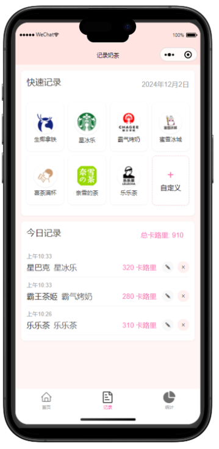

# 奶茶日记 (Milk Tea Diary)

一个帮助你追踪每日奶茶消费的微信小程序。

## 功能特点

- 📝 记录每日奶茶消费
- 📊 查看消费统计和趋势图
- 🎯 设置每月奶茶目标
- 💖 精美的粉色系界面设计
- 🏷️ 支持多个奶茶品牌选择（喜茶、星巴克、奈雪的茶等）

## 技术栈

- 微信小程序原生开发
- Canvas 绘图（用于统计图表展示）
- 本地数据存储（记录消费历史）

## 预览

### 首页


### 记录页


### 统计页


## 主要功能

- 快速记录每日奶茶消费
- 支持多个知名奶茶品牌
- 可视化展示消费趋势
- 设置每月消费目标
- 查看完成进度

## 安装和使用

1. 克隆仓库

```bash
git clone https://github.com/MilesSG/milk-tea-tracker.git
```

2. 使用微信开发者工具打开项目

3. 编译运行即可

## 开发计划

- [ ] 添加更多品牌选择
- [ ] 支持自定义奶茶品牌
- [ ] 添加消费金额统计
- [ ] 支持导出消费记录
- [ ] 添加社交分享功能

## 贡献

欢迎提交 Issue 和 Pull Request！

## 许可证

MIT License 